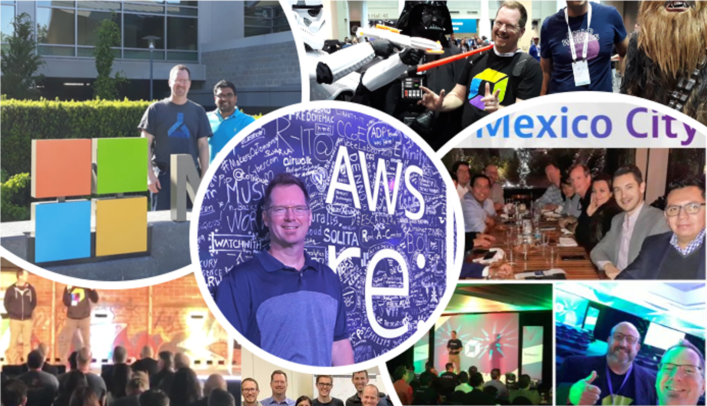

# Biography

[Rob Jahn](https://www.linkedin.com/in/robjahn/) is a DevOps advocate and Technical Partner Manager at Dynatrace software supporting market research and shaping strategic technology partner roadmaps with the hottest and newest technology companies. Rob develops and leads technical workshops and is a frequent speaker and blogger. Prior to Dynatrace, Rob was a technical services Director advising and building successful software, DevOps, and test automation solutions.

# Blogs

* [Dyntrace blog](https://www.dynatrace.com/news/blog/author/rob-jahn/)
* [Medium](https://medium.com/@robjahn)

| Where | Date | Title |
| --- | --- | --- |
| Dynatrace Blog | 2020_Dec_10 | [Panel Recap: How is your performance and reliability strategy aligned with your customer experience?](https://www.dynatrace.com/news/blog/panel-recap-how-is-your-performance-and-reliability-strategy-aligned-with-your-customer-experience/) |
| Dynatrace Blog | 2020_Nov_24 | [Using Dynatrace to master the 5 pillars of the AWS Well-Architected Framework (Part 1)](https://www.dynatrace.com/news/blog/using-dynatrace-to-master-the-5-pillars-of-the-aws-well-architected-framework-part-1/) |
| Dynatrace Blog | 2020_Nov_19 | [Simplify and standardize Dynatrace integration to Jenkins software delivery pipelines with shared libraries](https://www.dynatrace.com/news/blog/simplify-and-standardize-dynatrace-integration-to-jenkins-software-delivery-pipelines-with-shared-libraries/) |
| Dynatrace Blog | 2020_Aug_24 | [Dynatrace and AWS Systems Manager – Automate OneAgent distribution securely, centrally and at scale](https://www.dynatrace.com/news/blog/dynatrace-and-aws-systems-manager-automate-oneagent-distribution-securely-centrally-and-at-scale/) |
| Dynatrace Blog | 2020_Apr_14 | [AWS and Dynatrace automation hit the jackpot at Perform Las Vegas](https://www.dynatrace.com/news/blog/aws-and-dynatrace-automation-hit-the-jackpot-at-perform-las-vegas/)
| Dynatrace Blog | 2020_Mar_3 | [Up your quality and agility factor – using automation to build &quot;performance-as-a-self-service&quot;](https://www.dynatrace.com/news/blog/up-your-quality-and-agility-factor-using-automation-to-build-performance-as-a-self-service/) |
| Dynatrace Blog | 2019_Aug_1 | [Get started integrating Dynatrace into your Azure DevOps release pipelines](https://www.dynatrace.com/news/blog/get-started-integrating-dynatrace-in-your-azure-devops-release-pipelines/) |
| Dynatrace Blog | 2019_Jan_7 | [Joining the Dynatrace team – challenge accepted](https://www.dynatrace.com/news/blog/joining-the-dynatrace-team-challenge-accepted/) |
| Microsoft Open Source Blog | 2019_Jun_11 | [Five steps to add automated performance quality gates to Azure DevOps pipelines](https://cloudblogs.microsoft.com/opensource/2019/06/11/five-steps-add-automated-performance-quality-gates-azure-devops-pipelines/) |
| Microsoft Open Source Blog | 2019_Apr_25 | [Adding automated performance quality gates using Keptn Pitometer](https://cloudblogs.microsoft.com/opensource/2019/04/25/adding-automated-performance-quality-gates-using-keptn-pitometer/) |
| Medium | 2019_Oct_15 | [Keptn release 0.5.0 — Six updates to get excited about](https://medium.com/keptn/keptn-release-0-5-0-six-updates-to-get-excited-about-30ca1688fb9a) |
| Medium | 2019_Aug_8 | [Keptn now talks MS Teams: How we expand Keptn&#39;s footprint in the Microsoft world](https://medium.com/keptn/keptn-now-talks-ms-teams-how-we-expand-keptns-footprint-in-the-microsoft-world-c330c0c8d4f1) |
| Medium | 2019_Jul_17 | [On-boarding your custom application to Keptn— Part 2 of 2](https://medium.com/keptn/on-boarding-your-custom-application-to-keptn-part-2-of-2-56c6ec0bdcd5) |
| Medium | 2019_Jul_17 | [On-boarding your custom application to Keptn on GKE— Part 1 of 2](https://medium.com/keptn/on-boarding-your-custom-application-to-keptn-on-gke-part-1-of-2-e18817205e4a) |
| Medium | 2019_July_17 | [On-boarding your custom application to Keptn on AKS — Part 1 of 2](https://medium.com/keptn/on-boarding-your-custom-application-to-keptn-on-aks-part-1-of-2-fc15bb7d2a95) |
| Atlassian Developer Community Blog | 2020_Jun_17 | [How Dynatrace and Atlassian help transform your operations team to work smarter not harder](https://community.atlassian.com/t5/Marketplace-Apps-Integrations/How-Dynatrace-and-Atlassian-help-transform-your-operations-team/ba-p/1408752) |
| Atlassian Developer Community Blog | 2020_Apr_7 | [Using AI and automation to build resiliency into Bitbucket pipelines](https://community.atlassian.com/t5/Marketplace-Apps-Integrations/Using-AI-and-automation-to-build-resiliency-into-Bitbucket/ba-p/1343165) |
| LinkedIn Article | 2019_Mar_1 | [Joining the Dynatrace team – challenge accepted](https://www.linkedin.com/pulse/joining-dynatrace-team-challenge-accepted-rob-jahn/) |
| LinkedIn Article | 2020_Jan_31 | [2019 at Dynatrace: joining an industry leader](https://www.linkedin.com/pulse/2019-dynatrace-joining-industry-leader-rob-jahn/) |

# Videos

| Date | Where | Title | Links |
| --- | --- | --- | --- |
| 2020_Nov_01 | Dynatrace Website | Introducing AWS Partnership with Demo | > https://www.dynatrace.com/technologies/aws-monitoring] |
| 2019_Jul_01 | Microsoft Azure | Introducing Azure Lighthouse | > [Azure Website](https://azure.microsoft.com/en-us/services/azure-lighthouse/#features) |

# Presentations

| Date | Where | Title | Links |
| --- | --- | --- | --- |
| 2020_Oct_09 | DevOpsStage Conference | A Guide to Event-driven SRE-inspired DevOps: The end of your monolithic release process |  >[YouTube](https://www.youtube.com/watch?v=f0sNs_h_E7U&list=PL2DFnm8LBPXrCYIr4IXr3BrMDuqJ83GJo&index=5)|
| 2020_Sep_16 | AWS Twitch TV | Advanced Kubernetes Observability with Dynatrace |  >[Twitch TV Episode](https://www.twitch.tv/videos/743201902?collection=VV23gbfLCRbZLg) >[LinkedIn](https://www.linkedin.com/posts/dynatrace_aws-twitch-activity-6711682231678636032-_76A)|
| 2020_Jul_16 | Dynatrace Performance Clinics | Dynatrace for Jira - Transform your operations to work smarter not harder with Tempest | >[YouTube](https://www.youtube.com/watch?v=NTzuKREVl6Q&amp) |
| 2020_May_6 | Dynatrace Performance Clinics | Automate service delivery with Keptn, Atlassian and Dynatrace | >[YouTube](https://www.youtube.com/watch?v=XUDaKV-iR2g&amp) |
| 2020_Apr_30 | CloudNatives Lightning talks | Embracing service-level-objectives of your microservices in your CI/CD | >[Reg Page](https://events.nebulaworks.com/lightningtalk-april) >[YouTube](https://www.youtube.com/watch?v=F3OT38Q3USc) |
| 2020_Apr_16 | Keptn Community Meeting | Automate service delivery with Keptn and Atlassian | >[YouTube](https://www.youtube.com/watch?v=wx9roK4AnCo&t=755s) |
| 2020_Feb_16 | Dynatrace Perform 2020 | Increase quality and agility with performance as a self-serviceRelease Better Software Faster | >[Slides](https://event.on24.com/eventRegistration/console/EventConsoleApollo.jsp?&amp;eventid=2255809&amp;sessionid=1&amp;username=&amp;partnerref=&amp;format=fhvideo1&amp;mobile=false&amp;flashsupportedmobiledevice=false&amp;helpcenter=false&amp;key=F5A15B7190A3E88A8FF276B0A7391BE3&amp;text_language_id=en&amp;playerwidth=1000&amp;playerheight=650&amp;overwritelobby=y&amp;source=GATEWAY-1776389&amp;rId=1776389&amp;rKey=DA9D2E36A16E6B0FDCBE3CF5CA6E427F&amp;oriontokens=eventId-2255809%7CuserId-339806358%7CgatewayId-1776389%7CexperienceId-%7CcontentType-pdf&amp;newConsole=false&amp;nxChe=true&amp;eventuserid=339806358&amp;contenttype=A&amp;mediametricsessionid=299646422&amp;mediametricid=3190464&amp;usercd=339806358&amp;mode=launch) |
| 2019_Sep_3 | Dynatrace Performance Clinics | Continuous Build and Release Verification with Keptn Quality Gates | >[YouTube](https://www.youtube.com/watch?v=tM9prBoxOWA&amp) |
| 2019_Sep_12 | New England Java Users Group | Shipping code like a Keptn: Automating your Kubernetes Delivery Pipelines so you can focus on code | >[Reg Page](https://nejug.org/events/2019/09/keptn.html) |
| 2019_July_10 | Charlotte Microsoft Azure Meetup Group | Ship code like a keptn: Automating Azure Kubernetes Service Delivery Pipelines | >[Reg Page](https://www.meetup.com/Charlotte-Microsoft-Azure1/events/qlmdrqyzkbfb) | >[LinkedIn](https://www.linkedin.com/posts/activity-6555455700435300352-41SP) |
| 2019_July_30 | DevOps &amp; Drinks Meetup Group – NYC | Shipping Code like a keptn: Automating your Kubernetes Delivery Pipelines so you can focus on code | >[LinkedIn](https://www.linkedin.com/posts/activity-6562034936981835776-k2V0) >[Reg Page](https://www.meetup.com/DevOps-Docker-and-Beers/events/262650862/) |
| 2019_May_29 | DevOps Days Toronto | Short welcome on mainstage| >[LinkedIn](https://www.linkedin.com/posts/ugcPost-6539861615901233152-6fbE) |
| 2019_May_6 | Microsoft Build 2019 Conference | Using AI and automation to build resiliency into Azure DevOps | >[Video](https://azure.microsoft.com/en-in/resources/videos/build-2019-using-ai-and-automation-to-build-resiliency-into-azure-devops)  | >[Slides](https://www.slideshare.net/RobJahn/using-ai-and-automation-to-build-resiliency-into-azure-dev-ops) | >[LinkedIn](https://www.linkedin.com/posts/dynatrace_microsoft-build-2019-developer-conference-activity-6530074854895468544-1jTA) |
| 2019_Apr_29 | Seattle SRE Meetup | Embracing service-level-objectives of your microservices in your CI/CD | >[YouTube](https://www.youtube.com/watch?v=qJXeDHfJkIU) >[Reg Page](https://www.meetup.com/Beyond-Seattle-SRE/events/268296476/) |

# Code

Description | Links |
| --- | --- |
| Misc Dynatrace demos and utilties | https://github.com/dt-demos |
| Altassian BitBucket Pipes | https://bitbucket.org/dynatrace |
| Altassian BitBucket Dynatrace demo | https://bitbucket.org/dynatracedemos |
| Code and scripts to provision and configure cloud infrastructure running a Kubernetes demo app | https://github.com/dt-kube-demo |
| Sample ecommerce application and scripts to provision kubernetes cluster and setup keptn as onboard app into keptn | https://github.com/keptn-orders |
| Neotys Performance Testing workshop | https://github.com/dynatrace-neoload-perf-workshop-infra ]

# Interviews

| Date | Title | Who | Links |
| --- | --- | --- | --- |
| Oct_23_2019 | DynatraceGo Mexico City | Alina Poulain | >[Reg Page](https://www.dynatrace.com/perform-go/latin-america/mexico-city/) >[Video](https://www.facebook.com/alinapoulainw/videos/interview-rob-jahn-noops-dynatrace/449045522674000/) |
