 

I am a SRE & DevOps advocate and Sr. Technical Partner Manager at [Dynatrace](https://www.dynatrace.com) software based out of Boston, Massachusetts, USA. At Dynatrace, I support technical partnerships with leading cloud providers and DevSecOps solutions. 

I am very active with open source projects and develop technical workshops, videos, industry presentations, and blogs. I am a passionate technology evangelist, helping companies get the best integrations and enablement for flawless and secure digital interactions with Dynatrace.

Prior to Dynatrace, I was a technical services Director advising and building successful software, DevOps, and test automation solutions for 15 years within Professional services companies. [LinkedIn Profile](https://www.linkedin.com/in/robjahn/)

# Misc

* [2022 cohort of Continous Delivery Global Community Ambassadors](https://cd.foundation/ambassadors/) 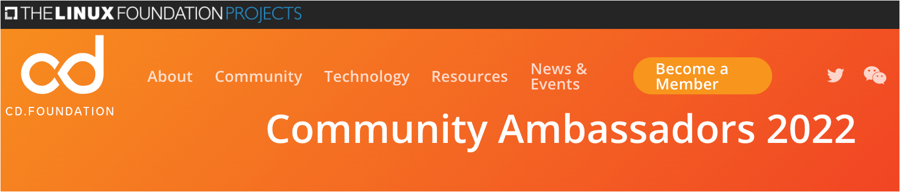

* [Dynatrace Partner Cafe series](https://www.youtube.com/playlist?list=PLqt2rd0eew1bfhreyYsVkLOy-DQTECycL) - short solution overview and demos of partners like AWS, Azure, Pagerduty, Launchdarkly, Atlassian - all personally produced and edited    
 

* Active with the Cloud-native application life-cycle orchestration [Cloud Native Computing Foundation (CNCF)](https://www.cncf.io) open source project [Keptn](https://keptn.sh) that Dynatrace is leading

# Presentations & Webinars

| Topic | Title | Links |
| --- | --- | --- | 
| CloudOps | Dynatrace Perform 2022 - Build a proactive approach to cloud operations for increased resilience - 2022_Feb_01  > [Dynatrace Perform site](https://www.dynatrace.com/perform) | 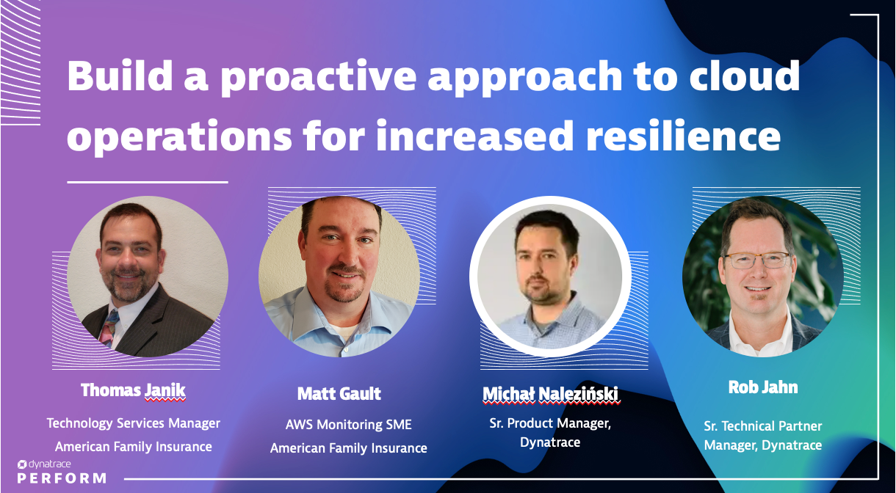 |
|  |Partner Integration - Dynatrace with PagerDuty and Rundeck - 2021_Nov_22  > [LinkedIn](https://www.linkedin.com/posts/robjahn_come-see-how-dynatrace-integrates-with-pagerduty-activity-6872999572197695488-viSZ)   > [YouTube](https://www.youtube.com/watch?v=Q9JVilqmmkU&t=6s) | 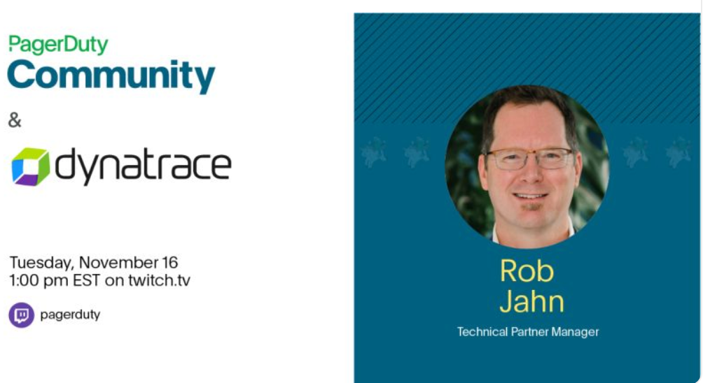 |
|  | How to build a resilient incident managment plan - 2021_Nov_19   > [LinkedIn](https://www.linkedin.com/posts/robjahn_digitalservices-activity-6866940035980177409-nd2x)   > [OnDemand webinar](https://event.on24.com/wcc/r/3479546/0720998BF35EAC9B04585D53ED227E66?partnerref=xMatters) | 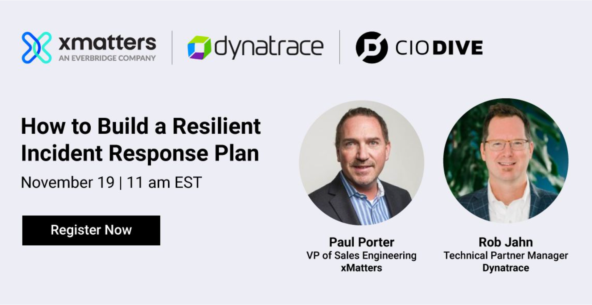  |
|  | Dynatrace and xMatters Make Seamless Efficiency Possible - 2021_Aug_19   >[LinkedIn](https://www.linkedin.com/posts/xmatters-inc_dynatrace-and-xmatters-make-seamless-efficiency-activity-6834164437679788032-mEWN)   > [YouTube](https://www.youtube.com/watch?v=U5AbrthQvb8) | 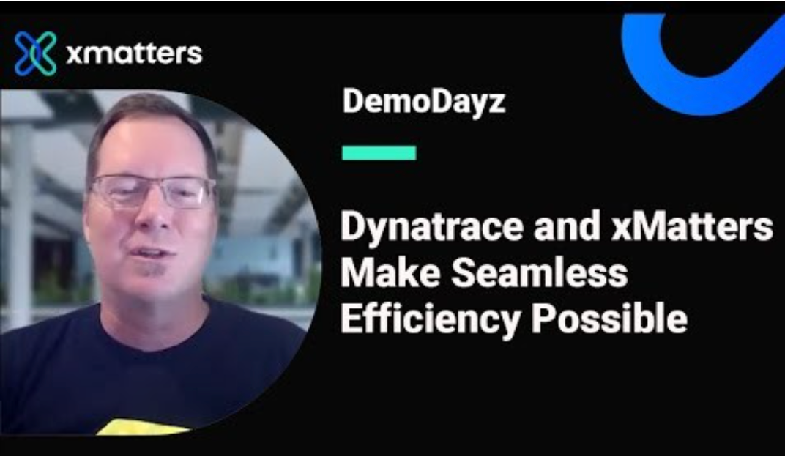 |
|  | [BrightTalk](https://www.brighttalk.com/) series: Inside AIOps: Optimizing Incident Management in 2021  Beyond Intelligent Incident Management: AIOps Done Right - 2021_Mar_30  >[BrightTalk WebCast](https://www.brighttalk.com/webcast/12363/470224) >[LinkedIn](https://www.linkedin.com/posts/bonjourerin_ep3-beyond-intelligent-incident-management-activity-6775148229441961984-bgOe) |  | 
|  | [xMatters](https://www.xmatters.com) Demo Dayz Webinar xMatters + Dynatrace, A Great Customer Experience - 2021_Mar_01   >[xMatters YouTube](https://www.youtube.com/watch?v=eHDO4ss8B8A&t=1117s) >[LinkedIn](https://www.linkedin.com/feed/update/urn:li:activity:6778286296323411968/) |  | 
|  | [LaunchDarkly](https://www.LaunchDarkly.com) Webinar Accelerating Remediation with Automation - 2021_Feb_25  >[LinkedIn](https://www.linkedin.com/posts/robjahn_continuousdelivery-innovation-automation-activity-6765320686366932992-sDDf) |  |
| DevOps |  DevOps Toronto February - GitOps & SLO-Driven Automation for faster and better releases - 2022_Feb_01   > [YouTube](https://www.youtube.com/watch?v=ShrolCUrC2U) | 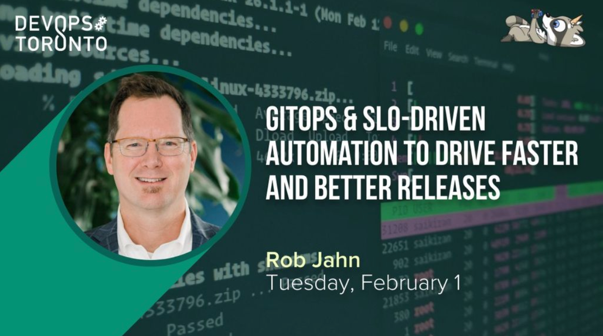  |
|  |  Dynatrace Perform 2022 - Achieve risk-free delivery by automating zero downtime release strategies - 2022_Feb_01   > [Dynatrace Perform site](https://www.dynatrace.com/perform)| 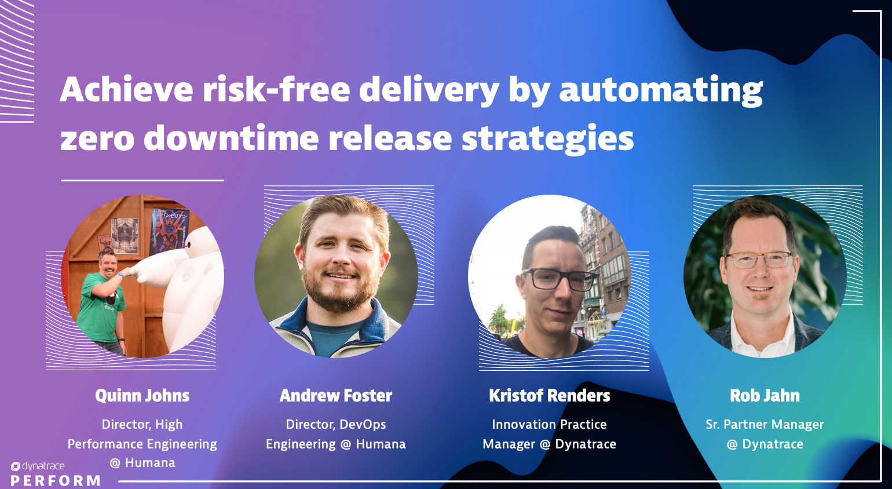 |
|  | DevOps Enterprise Summit - VendorDome: Beyond the Buzzwords: Going Deep on DevOps with Dynatrace & LaunchDarkly - 2021_Nov_09   > [On Demand Webinar](https://videos.itrevolution.com/watch/625781052)   > [Event Page](https://devopsenterprisesummitus2021.sched.com/event/lxBG) | 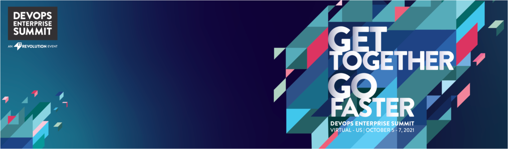 |
|  | The Fast & the foolproof: Automation & Observability for DevOps - 2021_Aug_25   >[LinkedIn](https://www.linkedin.com/posts/robjahn_the-fast-the-foolproof-automation-observability-activity-6833136616953958400-bXZN)   >[Video](https://jfrog.com/webinar/the-fast-the-foolproof-automation-observability-for-devops/) | 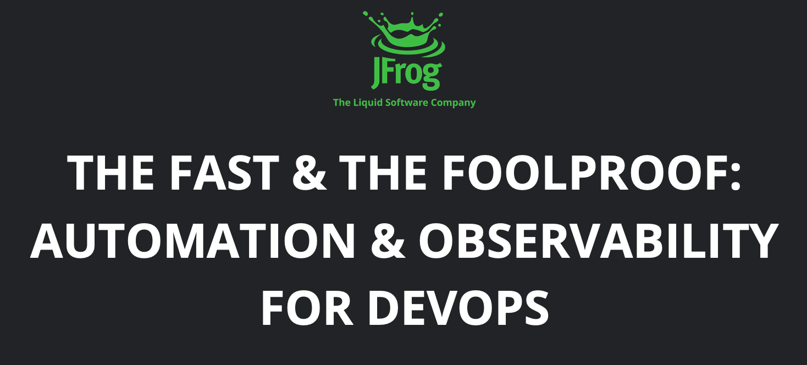 |
|  | [SLO Conference](https://www.youtube.com/watch?v=dybGudpsuYo ) - Dynatrace Software Intellegence Platform & Service Level Indicators - 2021_May_01  >[LinkedIn](https://www.linkedin.com/posts/robjahn_dynatrace-sloconf-sres-activity-6801274023805284353--0H0)   > [YouTube](https://www.youtube.com/watch?v=dybGudpsuYo) | 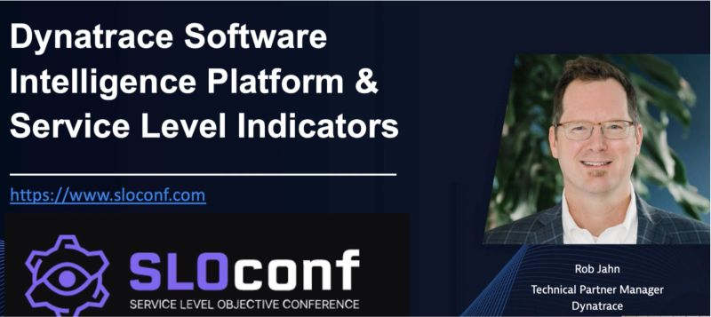 |
|  | [Seatle SRE Meetup](https://www.meetup.com/Beyond-Seattle-SRE/events/277122515/) - Service Level Objectives - why are we still talking about this? - 2021_Apr_28  >[LinkedIn](https://www.linkedin.com/feed/update/urn:li:activity:6793949554283835392/)   > [YouTube](https://www.youtube.com/watch?v=PLbIOd7NkSU&t=1618s) |  |
|  | [DevOpsStage Conference](https://devopsstage.com/)   A Guide to Event-driven SRE-inspired DevOps: The end of your monolithic release process - 2020_Oct_09  >[YouTube](https://www.youtube.com/watch?v=f0sNs_h_E7U&list=PL2DFnm8LBPXrCYIr4IXr3BrMDuqJ83GJo&index=5) |   |
|  | [Dynatrace Performance Clinics](https://www.youtube.com/playlist?list=PLqt2rd0eew1YFx9m8dBFSiGYSBcDuWG38)   Automate service delivery with Keptn, Atlassian and Dynatrace - 2020_May_6  >[YouTube](https://www.youtube.com/watch?v=XUDaKV-iR2g&amp)|    |
|  | Dynatrace Webinar   Successful Cloud Migration to Microsoft Azure On-demand - 2020_May_01  >[Video](https://info.dynatrace.com/noram_all_wc_successful_cloud_migration_to_microsoft_azure_14329_od_fulfillment.html) >[LinkedIn](https://www.linkedin.com/posts/robjahn_dynatrace-azure-activity-6651204308081659904-2dpK/) |    |
|  | [Nebulaworks](https://www.nebulaworks.com/) CloudNatives Lightning talks   Embracing service-level-objectives of your microservices in your CI/CD - 2020_Apr_30   >[Reg Page](https://events.nebulaworks.com/lightningtalk-april) >[YouTube](https://www.youtube.com/watch?v=F3OT38Q3USc) |    |
|  | Seattle SRE Meetup   Embracing service-level-objectives of your microservices in your CI/CD - 2020_Apr_29  >[YouTube](https://www.youtube.com/watch?v=qJXeDHfJkIU) >[Reg Page](https://www.meetup.com/Beyond-Seattle-SRE/events/268296476/) |    |
|  | Keptn Community Meeting   Automate service delivery with Keptn and Atlassian - 2020_Apr_16   >[YouTube](https://www.youtube.com/watch?v=wx9roK4AnCo&t=755s) |  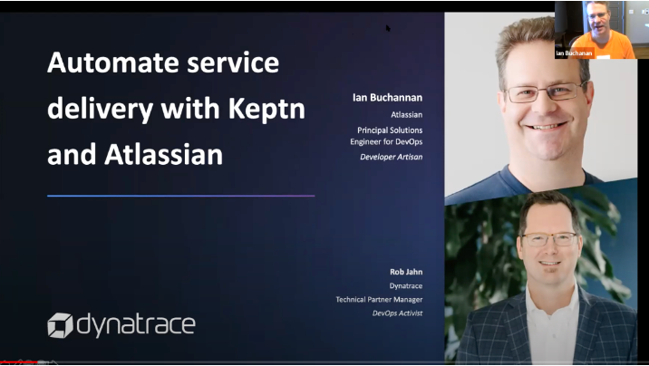  |
|  | [Performance Advisory Council](https://www.linkedin.com/showcase/performance-advisory-council/) Meetup  How to organize a team to take advantage of Performance as a Self-Service? - 2020_April_08  >[LinkedIn](https://www.linkedin.com/posts/robjahn_welcome-you-are-invited-to-join-a-webinar-activity-6651909463554965504-qk2X) |    |
|  | [Dynatrace Perform 2020 Conference](https://www.dynatrace.com/perform)   Release Better Software Faster: Increase quality and agility with performance as a self-service - 2020_Feb_16   [Slides](https://event.on24.com/eventRegistration/console/EventConsoleApollo.jsp?&amp;eventid=2255809&amp;sessionid=1&amp;username=&amp;partnerref=&amp;format=fhvideo1&amp;mobile=false&amp;flashsupportedmobiledevice=false&amp;helpcenter=false&amp;key=F5A15B7190A3E88A8FF276B0A7391BE3&amp;text_language_id=en&amp;playerwidth=1000&amp;playerheight=650&amp;overwritelobby=y&amp;source=GATEWAY-1776389&amp;rId=1776389&amp;rKey=DA9D2E36A16E6B0FDCBE3CF5CA6E427F&amp;oriontokens=eventId-2255809%7CuserId-339806358%7CgatewayId-1776389%7CexperienceId-%7CcontentType-pdf&amp;newConsole=false&amp;nxChe=true&amp;eventuserid=339806358&amp;contenttype=A&amp;mediametricsessionid=299646422&amp;mediametricid=3190464&amp;usercd=339806358&amp;mode=launch) |   |
| |   [Dynatrace Performance Clinics](https://www.youtube.com/playlist?list=PLqt2rd0eew1YFx9m8dBFSiGYSBcDuWG38)   Continuous Build and Release Verification with Keptn Quality Gates - 2019_Sep_3    >[YouTube](https://www.youtube.com/watch?v=tM9prBoxOWA&amp) |    |
|  | New England Java Users Group   Shipping code like a Keptn: Automating your Kubernetes Delivery Pipelines so you can focus on code - 2019_Sep_12   >[Reg Page](https://nejug.org/events/2019/09/keptn.html) |   |
|  | Toronto DevOps Meetup Group   Shipping code like a Keptn - 2019_Aug_06  >[LinkedIn](https://www.linkedin.com/posts/robjahn_keptn-activity-6564913586899087365-Nx-4) |    |
|  |   Charlotte Microsoft Azure Meetup Group   Ship code like a keptn: Automating Azure Kubernetes Service Delivery Pipelines - 2019_July_10   >[Reg Page](https://www.meetup.com/Charlotte-Microsoft-Azure1/events/qlmdrqyzkbfb)   >[LinkedIn](https://www.linkedin.com/posts/activity-6555455700435300352-41SP) |    |
|  | DevOps &amp; Drinks Meetup Group – NYC   Shipping Code like a keptn: Automating your Kubernetes Delivery Pipelines so you can focus on code - 2019_July_30  >[LinkedIn](https://www.linkedin.com/posts/activity-6562034936981835776-k2V0) >[Reg Page](https://www.meetup.com/DevOps-Docker-and-Beers/events/262650862/) |    |
|  | Microsoft Build 2019 Conference   Using AI and automation to build resiliency into Azure DevOps - 2019_May_6  >[Video](https://azure.microsoft.com/en-in/resources/videos/build-2019-using-ai-and-automation-to-build-resiliency-into-azure-devops) >[Slides](https://www.slideshare.net/RobJahn/using-ai-and-automation-to-build-resiliency-into-azure-dev-ops) >[LinkedIn](https://www.linkedin.com/posts/dynatrace_microsoft-build-2019-developer-conference-activity-6530074854895468544-1jTA) |   |
|  | DevOps with Dynatrace and Atlassian - Demo Den - May 2021  > [YouTube](https://www.youtube.com/watch?v=5fnSyJZJObI) | 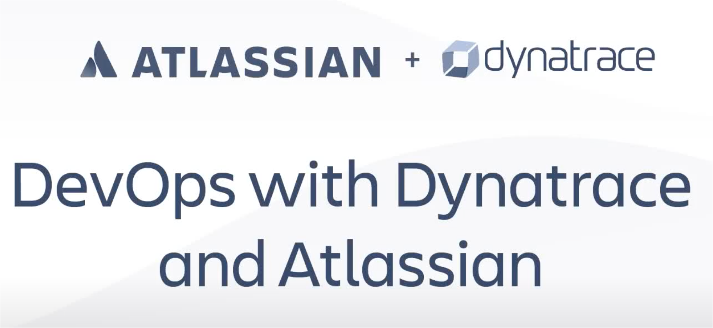   |
|  | Dynatrace AWS Partnership Overview with Demo - 10 minute overview and demo shared on the Dynatrace.com website   >[Dynatrace Website](https://www.dynatrace.com/technologies/aws-monitoring) |   |
|  | DevOps Days Toronto   Short welcome on mainstage - 2019_May_29  >[LinkedIn](https://www.linkedin.com/posts/ugcPost-6539861615901233152-6fbE) |    |
| Modernization | Dynatrace Perform 2022 - Cloud-native hyperscale with Dynatrace & AWS Lambda - 2022_Feb_01  > [Dynatrace Perform site](https://www.dynatrace.com/perform) | 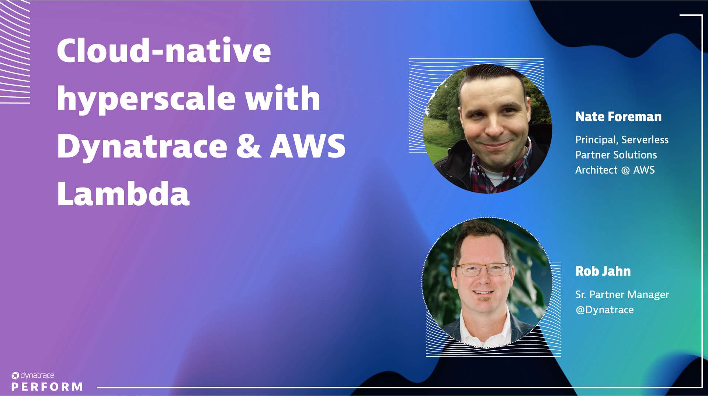 |
|  | AWS re:Invent 2021 - Cloud-native hyperscale with Dynatrace and AWS Lambda - 2021_Dec_17   > [YouTube](https://www.youtube.com/watch?v=jNT18U0-q5k&t=1s) | 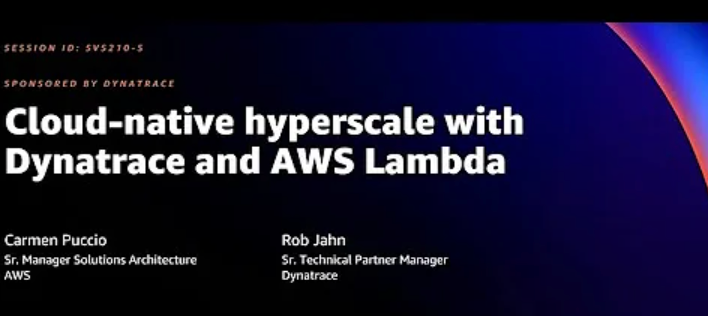 |
|  | [Dynatrace Perform 2021 Conference](https://www.dynatrace.com/perform) Solving modernization challenges with Microsoft Azure and Dynatrace - 2021_Jan_01  >[LinkedIn](https://www.linkedin.com/posts/robjahn_perform-2021-dynatrace-activity-6762778635523956736-U-Ys) >[Dynatrace](https://www.dynatrace.com/perform-2021) |  | 
|  | [Dynatrace Perform 2021 Conference](https://www.dynatrace.com/perform)   Application Modernization with AWS: Three Key Considerations - 2021_Jan_01  >[LinkedIn](https://www.linkedin.com/posts/robjahn_perform-2021-dynatrace-activity-6762491553807142912-46QT) >[Dynatrace](https://www.dynatrace.com/perform-2021) |  | 
|  | AWS Twitch TV   Advanced Kubernetes Observability with Dynatrace - 2020_Sep_16   >[Twitch TV Episode](https://www.twitch.tv/videos/743201902?collection=VV23gbfLCRbZLg) >[LinkedIn](https://www.linkedin.com/posts/dynatrace_aws-twitch-activity-6711682231678636032-_76A) | |
|  | Dynatrace Performance Clinics   Dynatrace for Jira - Transform your operations to work smarter not harder with Tempest - 2020_Jul_16  >[YouTube](https://www.youtube.com/watch?v=NTzuKREVl6Q&amp) |   |
|  | [CMG](cmg.org) Data Centers and Cloud Infrastructure Virtual Conference How to transform faster by solving modernization challenges - 2021_Mar_30  >[CMG Event Page](https://www.cmg.org/2021/03/how-to-transform-faster-by-solving-modernization-challenges-rob-jahn-and-rod-kruetzfeld/) |  | 
|  | Dynatrace Webinar   5 Steps to Accelerate AWS Cloud Migration - 2020_Jun_18  >[LinkedIn](https://www.linkedin.com/feed/update/urn:li:activity:6676498233591644161/) |    |
|  | Introducing Dynatrace solution for Azure Lighthouse - production studio company recorded in the Dynatrace office and played on the Azure website and at a booth at an Azure conference    >[Azure Website](https://azure.microsoft.com/en-us/services/azure-lighthouse/#features) |   |

# Workshops

| Title | Links |
| --- | --- |
| 2021   AWS Immersion Days - Multiple Virtual sessions   >[Dynatrace](https://www.eventbrite.com/e/aws-immersion-day-modernization-and-advanced-observability-with-dynatrace-tickets-136457314501) |   |
| 2021   Dynatrace Perform Modernization - Multiple Virtual sessions   >[LinkedIn](https://www.linkedin.com/posts/robjahn_dynatrace-activity-6759116072626003968-ocUV) |   |
| 2021   Dynatrace Perform 2021 Conference Hands On training | 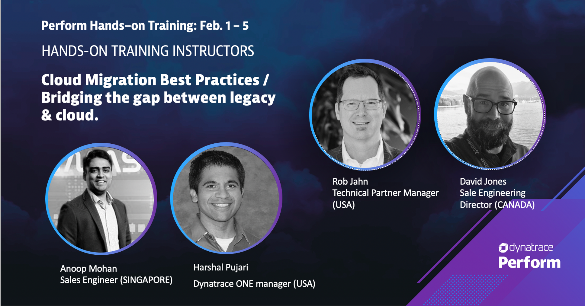 |
| 2020   Azure and Dynatrace - Multiple Virtual sessions   >[Dynatrace](https://info.dynatrace.com/noram_upper_midwest_wc_microsoft_virtual_workshop_14705_registration.html) |   |
| 2020   AWS Modernization - Virtual   >[AWS](https://pages.awscloud.com/GLOBAL-partner-OE-MAD-Virtual-Workshop-Series-2020-reg-event.html) >[LinkedIn](https://www.linkedin.com/posts/robjahn_amazon-web-services-aws-cloud-computing-activity-6704778215082221569-Kw2z) |   |
| 2020   RedHat and Dynatrace - Wisconsin [LinkedIn](https://www.linkedin.com/posts/robjahn_dynatrace-redhat-openshift-activity-6600480067686625280-04QL) |    > |
| 2020   Dynatrace Perform 2020 Conference Hands On training | 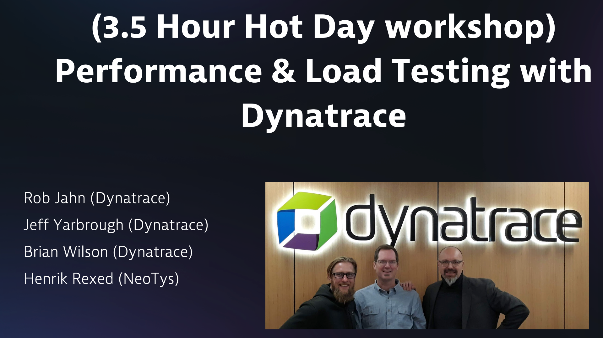 |
| Neotys Performance Testing workshop   > [Code](https://github.com/dynatrace-neoload-perf-workshop-infra) | 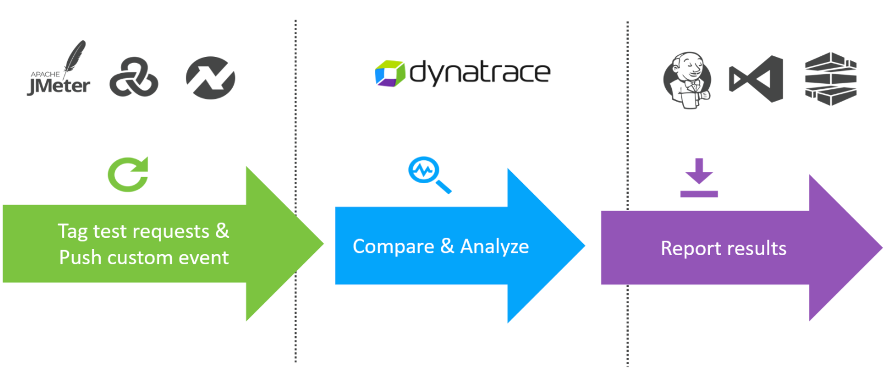 |
| 2019   Dynatrace Azure Hands-On CI/CD Workshop - Rochester NY   >[LinkedIn](https://www.linkedin.com/posts/robjahn_microsoft-activity-6534827866046160896-0dpP)|   |
| 2019   Dynatrace and Azure DevOps - Akron Ohio   >[LinkedIn](https://www.linkedin.com/posts/robjahn_dynatrace-azure-activity-6509461180191510529-_fTU) |   |
| 2019   Dynatrace and Azure DevOps - Clevland Ohio   >[LinkedIn](https://www.linkedin.com/posts/robjahn_dynatrace-azure-activity-6509048904774938624-yQHe)|   |
| 2019   Dynatrace and Azure DevOps - Cincinnati Ohio   >[LinkedIn](https://www.linkedin.com/posts/robjahn_dynatrace-azure-activity-6508794802589491200-OUKH)|   |
| 2019   Unbreakable Continuous Delivery Workshop - MTC Boston   >[LinkedIn](https://www.linkedin.com/posts/robjahn_azuredevops-dynatrace-activity-6505917118201028608-pidZ)|   |

# Quickstart Guides

| Description | Links |
| --- | --- |
| Dynatrace Alliances Team workshops   > [Code](https://github.com/dt-alliances-workshops)   > [Guide](https://learn.alliances.dynatracelabs.com/) | 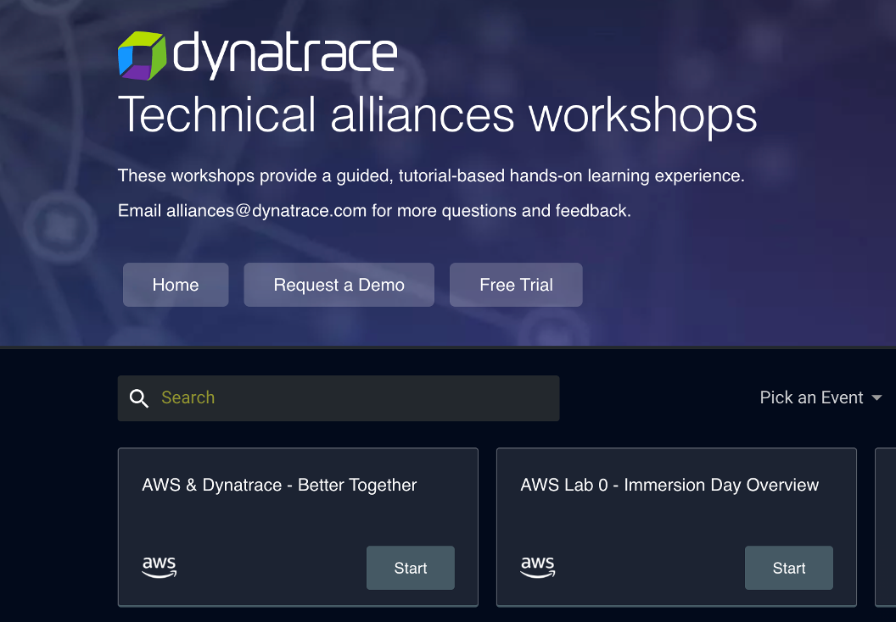 |
| Dynatrace Cloud Automation Quick Start  > [Guide](https://github.com/dt-alliances/cloud-automation-quickstart)  | 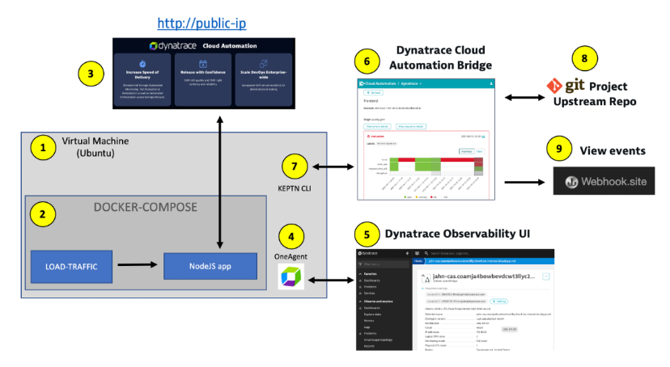 |
| Jfrog Pipelines - Dynatrace integration Reference Design   [Guide](https://www.jfrog.com/confluence/display/JFROG/Pipelines-Dynatrace+Reference+Design) | 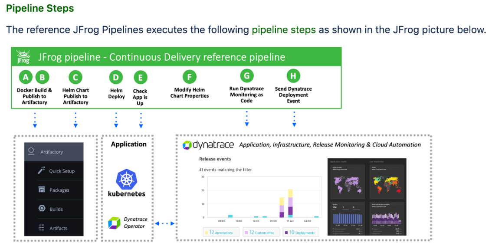 |
| Atlassian team 2021 - Automatically create a Jira Software issue from a detected problem in Dynatrace   > [Guide](https://www.atlassian.com/devops/observability-tutorials/jira-dynatrace-issue) | 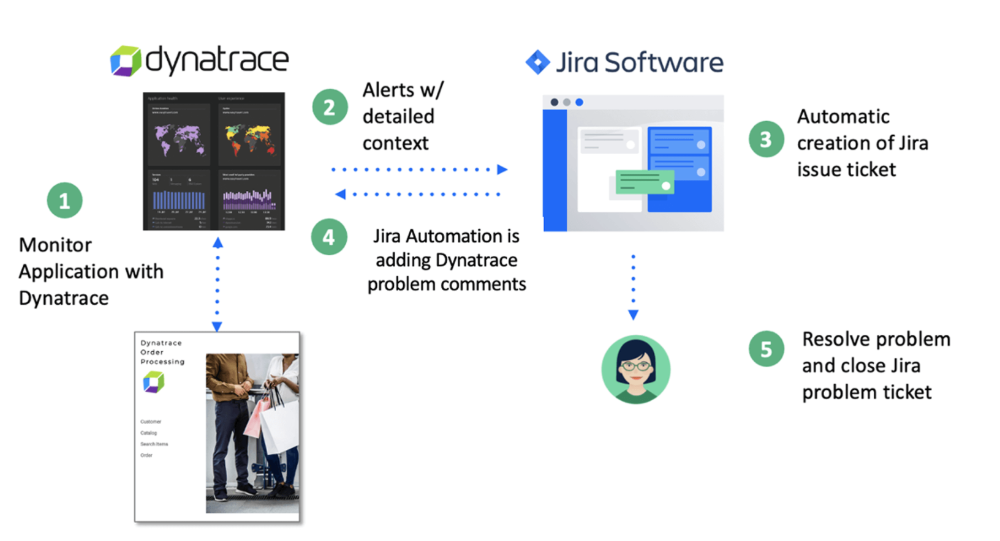 |
| AWS Modernization workshop   > [Code](https://github.com/dt-demos/modernize-workshop-setup)   > [Guide](https://dynatrace.awsworkshop.io) | 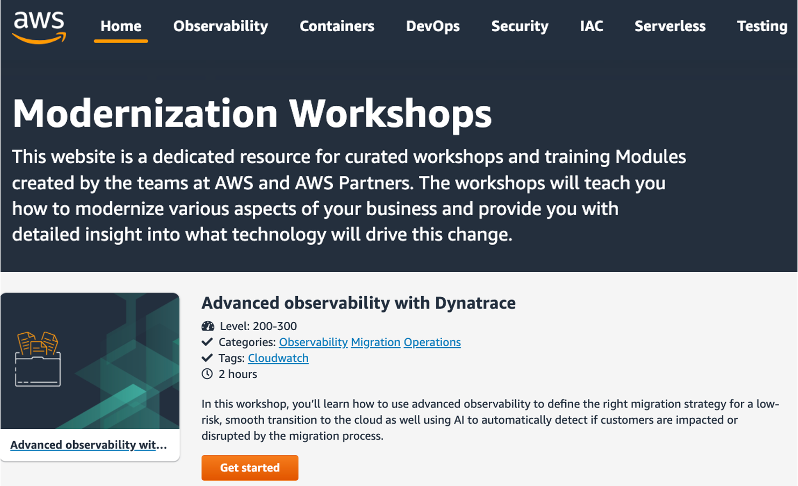  |

# Blogs

* [Dynatrace blog](https://www.dynatrace.com/news/blog/author/rob-jahn/)
* [Medium](https://medium.com/@robjahn)
* [Microsoft Open Source Blog](https://cloudblogs.microsoft.com/opensource/author/rob-jahn/)

| Topic | Title |
| --- | --- |
| AWS| AWS Marketplace - [Increasing observability in your AWS Control Tower landing zone with Dynatrace](https://aws.amazon.com/blogs/awsmarketplace/increasing-observability-in-your-aws-control-tower-landing-zone-with-dynatrace/) |
| | Dynatrace Blog - [Dynatrace Support for AWS Lambda Functions Powered by x86 and AWS Graviton2](https://www.dynatrace.com/news/blog/support-for-aws-lambda-functions-powered-by-aws-graviton2-processor/) |
|  | Dynatrace Blog - [Dynatrace named a new Amazon EKS Anywhere partner](https://www.dynatrace.com/news/blog/dynatrace-a-new-amazon-eks-anywhere-partner/) |
|  | Dynatrace Blog - [Dynatrace named a launch partner of Amazon ECS Anywhere](https://www.dynatrace.com/news/blog/dynatrace-named-a-launch-partner-of-amazon-ecs-anywhere) |
|   | Dynatrace Blog - [Using Dynatrace to master the 5 pillars of the AWS Well-Architected Framework (Part 1)](https://www.dynatrace.com/news/blog/using-dynatrace-to-master-the-5-pillars-of-the-aws-well-architected-framework-part-1/) |
|  | Dynatrace Blog - [Dynatrace and AWS Systems Manager – Automate OneAgent distribution securely, centrally and at scale](https://www.dynatrace.com/news/blog/dynatrace-and-aws-systems-manager-automate-oneagent-distribution-securely-centrally-and-at-scale/) |
|  | Dynatrace Blog - [AWS and Dynatrace automation hit the jackpot at Perform Las Vegas](https://www.dynatrace.com/news/blog/aws-and-dynatrace-automation-hit-the-jackpot-at-perform-las-vegas/) |
| DevOps | Atlassian Developer Community Blog - [Using AI and automation to build resiliency into Bitbucket pipelines](https://community.atlassian.com/t5/Marketplace-Apps-Integrations/Using-AI-and-automation-to-build-resiliency-into-Bitbucket/ba-p/1343165) |
|  | Dynatrace Blog - [Part 1: How Dynatrace and GitHub help you deliver better software faster](https://www.dynatrace.com/news/blog/how-dynatrace-and-github-help-you-deliver-better-software-faster) |
|  | Dynatrace Blog - [Part 2: How Dynatrace and GitHub help you deliver better software faster](https://www.dynatrace.com/news/blog/how-dynatrace-and-github-help-you-deliver-better-software-faster-part-2/) |
|  | Atlassian Developer Community Blog - [How Dynatrace and Atlassian help transform your operations team to work smarter not harder](https://community.atlassian.com/t5/Marketplace-Apps-Integrations/How-Dynatrace-and-Atlassian-help-transform-your-operations-team/ba-p/1408752) |
|   | Dynatrace Blog - [Simplify and standardize Dynatrace integration to Jenkins software delivery pipelines with shared libraries](https://www.dynatrace.com/news/blog/simplify-and-standardize-dynatrace-integration-to-jenkins-software-delivery-pipelines-with-shared-libraries) |
|  | Dynatrace Blog - [Up your quality and agility factor – using automation to build &quot;performance-as-a-self-service&quot;](https://www.dynatrace.com/news/blog/up-your-quality-and-agility-factor-using-automation-to-build-performance-as-a-self-service/) |
|  | Dynatrace Blog - [Get started integrating Dynatrace into your Azure DevOps release pipelines](https://www.dynatrace.com/news/blog/get-started-integrating-dynatrace-in-your-azure-devops-release-pipelines/) |
|  | Microsoft Open Source Blog - [Five steps to add automated performance quality gates to Azure DevOps pipelines](https://cloudblogs.microsoft.com/opensource/2019/06/11/five-steps-add-automated-performance-quality-gates-azure-devops-pipelines/) |
|  |  Microsoft Open Source Blog - [Adding automated performance quality gates using Keptn Pitometer](https://cloudblogs.microsoft.com/opensource/2019/04/25/adding-automated-performance-quality-gates-using-keptn-pitometer/) |
| | Medium - [Keptn release 0.5.0 — Six updates to get excited about](https://medium.com/keptn/keptn-release-0-5-0-six-updates-to-get-excited-about-30ca1688fb9a) |
|  | Medium - [Keptn now talks MS Teams: How we expand Keptn&#39;s footprint in the Microsoft world](https://medium.com/keptn/keptn-now-talks-ms-teams-how-we-expand-keptns-footprint-in-the-microsoft-world-c330c0c8d4f1) |
| | Medium - [On-boarding your custom application to Keptn— Part 2 of 2](https://medium.com/keptn/on-boarding-your-custom-application-to-keptn-part-2-of-2-56c6ec0bdcd5) |
|  | Medium - [On-boarding your custom application to Keptn on GKE— Part 1 of 2](https://medium.com/keptn/on-boarding-your-custom-application-to-keptn-on-gke-part-1-of-2-e18817205e4a) |
|  | Medium - [On-boarding your custom application to Keptn on AKS — Part 1 of 2](https://medium.com/keptn/on-boarding-your-custom-application-to-keptn-on-aks-part-1-of-2-fc15bb7d2a95) |
| Dynatrace | Dynatrace Blog - [Panel Recap: How is your performance and reliability strategy aligned with your customer experience?](https://www.dynatrace.com/news/blog/panel-recap-how-is-your-performance-and-reliability-strategy-aligned-with-your-customer-experience/) |
| Personal | LinkedIn Article - [2019 at Dynatrace: joining an industry leader](https://www.linkedin.com/pulse/2019-dynatrace-joining-industry-leader-rob-jahn/) |
|  | LinkedIn Article - [Joining the Dynatrace team – challenge accepted](https://www.linkedin.com/pulse/joining-dynatrace-team-challenge-accepted-rob-jahn/) |

# Code

| Description | 
| --- | 
| Multi-service ecommerce demo application used in workshops and demos  > [Latest Code](https://github.com/dt-orders/overview) > [Older version](https://github.com/dt-kube-demo) |
| Multiple repos with Dynatrace demos and utilities   > [Code](https://github.com/dt-demos) |
| Dynatrace Alliances Team workshop scripts and content repos   > [Code](https://github.com/dt-alliances-workshops) |
| Dynatrace Alliances cloud automation guides and utilities   > [Code](https://github.com/dt-alliances-workshops) |
| Altassian BitBucket Pipes   > [Dynatrace Code](https://bitbucket.org/dynatrace)   > [Keptn Code](https://bitbucket.org/keptn)   > [Demo App](https://bitbucket.org/dynatracedemos) |

# Interviews / Panelist

| Title | Links |
| --- | --- |
| Mar_11_2021   NeoTys & Orasi   Performance Engineering Customer Event |    >[LinkedIn](https://www.linkedin.com/feed/update/urn:li:activity:6777953473532063744/)
| Dec_15_2020   NeoTys & Orasi   Performance Engineering Customer Event |    >[LinkedIn](https://www.linkedin.com/posts/robjahn_dynatrace-userexperience-activity-6743184161898594304-JH8Y)
| Oct_23_2019   [Alina Poulain](https://www.linkedin.com/in/alinapoulain/)   DynatraceGo Mexico City |    >[Reg Page](https://www.dynatrace.com/perform-go/latin-america/mexico-city/)   >[Video](https://www.facebook.com/alinapoulainw/videos/interview-rob-jahn-noops-dynatrace/449045522674000/) |
